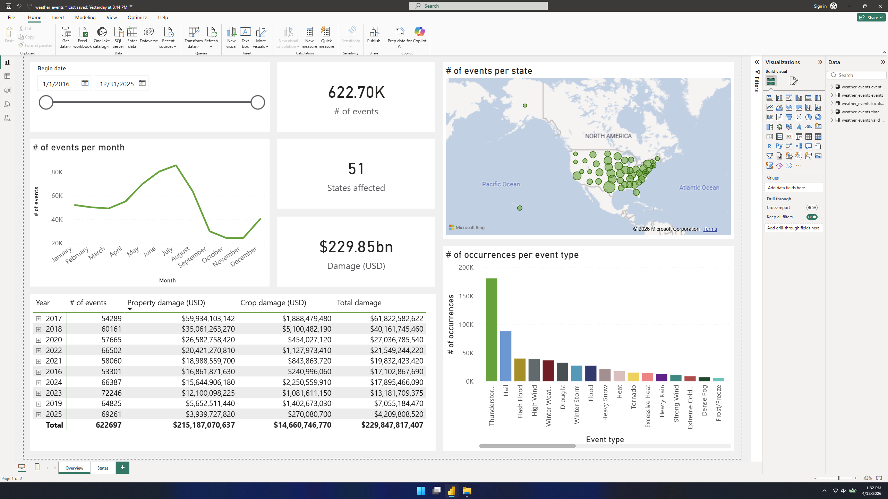
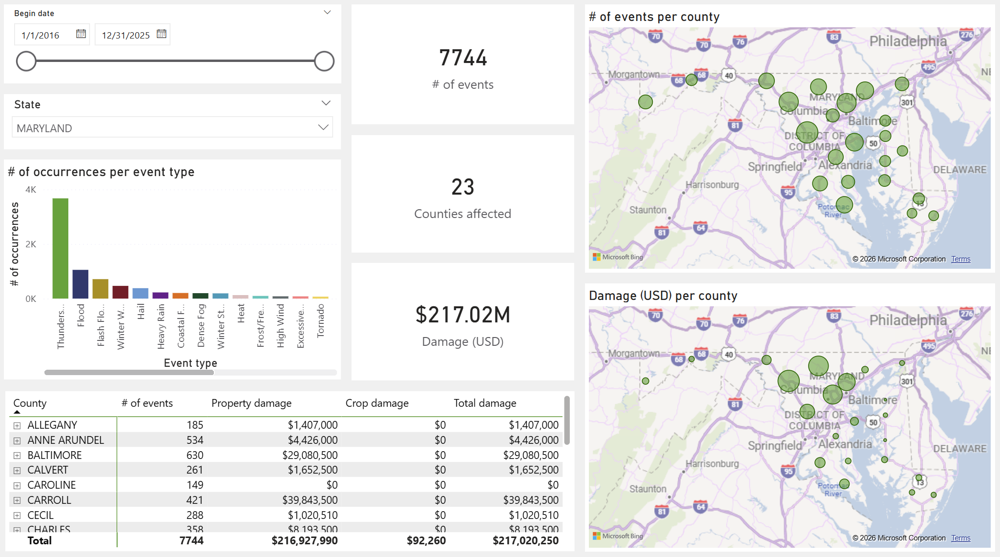
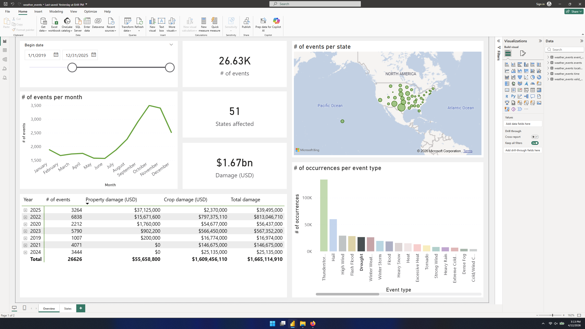
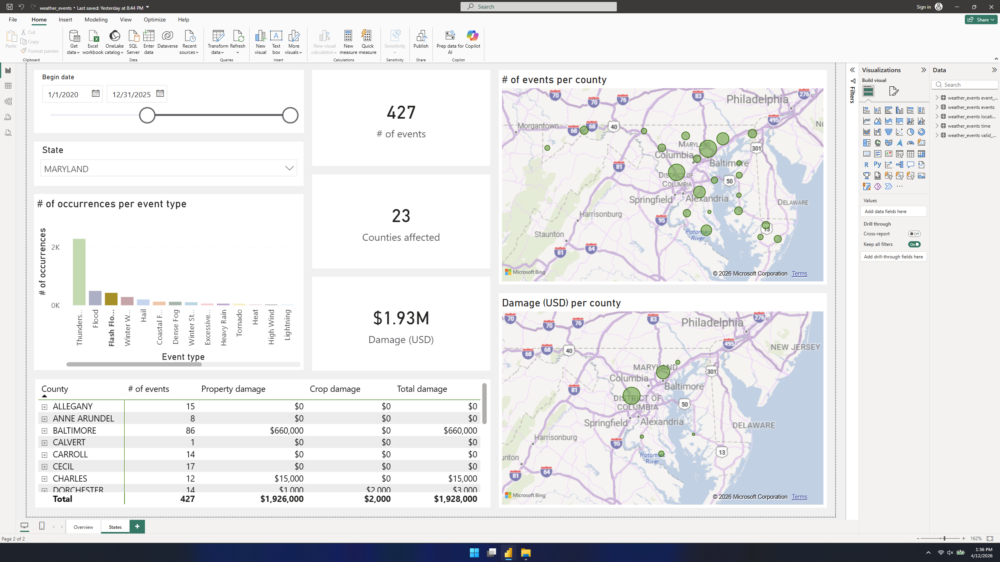

# NCEI Storm Events Analysis
This project creates a MySQL database from the National Centers for Environmental Information’s [Storm Events database](https://www.ncei.noaa.gov/stormevents/) and analyzes the data through a Power BI dashboard.

## Purpose
The purpose of this dashboard is to inform stakeholders in natural disaster and hazard recovery on what weather events have occurred, where they have occurred, and how much damage they have caused. 

## Tasks
- Import Storm Events datasets into single MySQL DB table
- Clean data w/ SQL
- Split table into separate tables, modeled after star schema
    - Reduces number of joins required, improving performance and making DB easier to understand
- Load DB into Power BI & create dashboard

## Dashboard
Preview images of the dashboard can be found below and in the images folder. The dashboard may also be interacted with by downloading the Power BI file titled 'weather_events.pbix'.
### Overview page
The overview page contains visuals that allow stakeholders to determine dates, weather events, and locations of interest.
 

   
  <em>Overview page</em>

### States page
Data of interest can be narrowed further with the states page, which displays data on a chosen state and its counties or equivalent locations.
 

   
  <em>States page</em>

### Filtering
Data on both pages can be filtered by interacting with their visuals.
 

   
  <em>Overview page filtered by date and event type</em>

   
  <em>States page filtered by date and event type</em>

